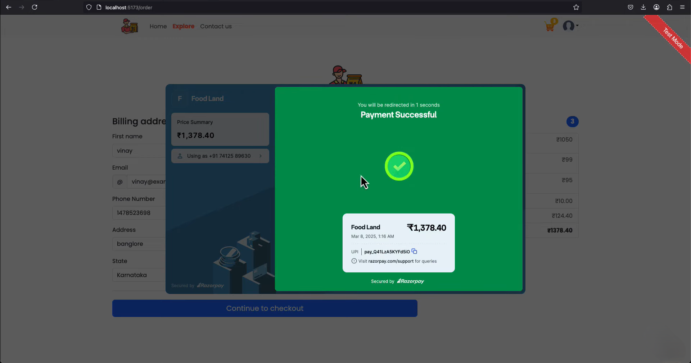

# 🍽️ QuickCrave: Full-Stack Online Food Delivery App

A sleek, responsive **online food ordering system** built with **React.js** and **Spring Boot**. Inspired by top platforms like Zomato and Swiggy, it enables seamless food browsing, cart management, UPI payments, and real-time order tracking.

--- 

## 📌 Table of Contents

- [🧠 About the Project](#-about-the-project)
- [💡 Problem Statement](#-problem-statement)
- [✅ Features](#-features)
- [🛠️ Technologies Used](#-technologies-used)
- [🚀 Setup Instructions](#-setup-instructions)
- [📸 Screenshots](#-screenshots)
- [✨ Unique Points](#-unique-points)
- [📬 Contact](#-contact)

---

## 🧠 About the Project
<div align="center">
  <table>
    <tr>
      <td>
        
      </td>
      <td>
        
      </td>
    </tr>
  </table>
</div>

**FoodieExpress** allows users to:
- Browse food items by category
- Add food to cart and pay online via Razorpay
- Admin can manage food items and customer orders
- Customers can track their order status in real time

---

## 💡 Problem Statement

Food delivery apps often involve complex integrations. This project aims to:
- Simplify the end-to-end food delivery experience
- Integrate payment, media, and email services
- Provide real-time order tracking for customers and admin

---

## ✅ Features

### 🔐 User Authentication

<div align="center">
  <table>
    <tr>
      <td>
        
      </td>
      <td>
        
      </td>
    </tr>
  </table>
</div>

- Register/Login using email and password
- User sessions maintained securely using JWT tokens
- Role-based access (Admin and Customer)

## 🛒 Customer Side Features

### 🍽️ Browse Food by Category and Name

<div align="center">
  <table>
    <tr>
      <td>
        
      </td>
      <td>
        
      </td>
    </tr>
  </table>
</div>

- Users can view available food items categorized by cuisine or meal type (e.g., North Indian, South Indian, Beverages)
- Search functionality lets customers quickly find food items by typing the name
- Real-time filtered display based on selected categories

### 🛍️ Add to Cart and Place Order

<div align="center">
  <table>
    <tr>
      <td>
        
      </td>
      <td>
        
      </td>
    </tr>
  </table>
</div>

- Customers can add multiple food items to the cart with quantity selection
- Live cart summary updates pricing dynamically
- Users can update/remove items before placing the order

### 💳 Razorpay Payment Integration

<div align="center">  </div>

- Secure payment handling via Razorpay
- Live transaction status update after redirection from payment gateway
- Orders only processed after successful payment

### 📦 Track Order History

<div align="center">  </div>

- Customers can view all their past orders with time, date, and item details
- Order status tracking for each placed order

---

## 🧑‍💼 Admin Side Features

### 🧾 Manage Food Items

<div align="center">  </div>

- Admins can add, update, or delete food items from the menu
- Food details include name, category, image, price, and availability
- Admin panel provides instant feedback on actions (e.g., "Food item added successfully")

### 🗃️ Manage Categories

<div align="center">  </div>

- Create and remove food categories dynamically
- Categories help structure the menu for easy browsing by users
- Ensures only active categories are visible to customers

### 📄 Customer Order Management

<div align="center">  </div>

- View all customer orders placed through the application
- Filter orders by date, user, or food item
- Orders include payment status, transaction ID, and delivery info

### 📊 Dashboard Overview

- Visual summary of total orders, users, and food items
- Quick snapshot of platform performance and customer activity

---

## 🛠️ Technologies Used

### 🔹 Frontend:
- React.js
- Bootstrap / Tailwind CSS
- Axios  
- React Router

### 🔹 Backend:
- Spring Boot  
- MongoDB  
- Spring Security  
- Razorpay Integration  
- AWS S3 for media hosting  

### 🔹 Database:
- MongoDB

### 🔹 Payment:
- Razorpay (test integration)

### 🔹 Media & File Handling:
- AWS (for image uploads)

### 🔹 Email:
- Gmail API

---

## 🚀 Setup Instructions

### 🔃 Clone the Repository

```bash
git clone https://github.com/sandipanrakshit34/FoodieExpress-Full-Stack-Online-Food-Delivery-App
```

### 🧩 Backend Setup (Spring Boot)

1. Open the `foodiesapi` folder in IntelliJ IDEA or your preferred IDE.
2. Open `src/main/resources/application.properties` and add your AWS & Razorpay keys:

```properties
spring.data.mongodb.uri=YOUR_DEVICE_MONGODB_URL

# AWS S3 Configuration
aws.access.key=YOUR_AWS_ACCESS_KEY
aws.secret.key=YOUR_AWS_SECRET_KEY
aws.region=YOUR_AWS_REGION
aws.s3.bucketname=foodies-foods

# JWT Configuration
jwt.secret.key=YOUR_JWT_SECRET_KEY

# Razorpay Configuration
razorpay_key=YOUR_RAZORPAY_KEY
razorpay_secret=YOUR_RAZORPAY_SECRET
```

3. Create a database in MongoDB Compass:
   ```
   CREATE DATABASE foodies;
   ```
4. Run the main class:
```
FoodiesapiApplication.java
```
✅ Spring Boot will start on `http://localhost:8080` and connect to your `MongoDB`. Collections will be auto-generated.

--

### 💻 Frontend Setup (React)

### 👨‍💼 Admin Panel Setup

1. Open terminal, navigate to the admin panel:
```
cd adminpanel
```
2. Install dependencies and start the server:
```
npm install
npm install --save-dev ajv@^7
npm run dev
```

3. Open your browser at:
   ```
   http://localhost:5173/
   ```

### 👨‍🍳 User Panel Setup

1. Open another terminal, navigate to the user panel:
```
cd foodies
```
2. Install dependencies and start the server:
```
npm install
npm install --save-dev ajv@^7
npm run dev
```
3. Open your browser at:

```
http://localhost:5174/
```

---
### 🔐 AWS & Razorpay Integration
- AWS S3 is used for uploading food images from the admin panel and retrieving them in the UI
- Razorpay is integrated for secure online UPI payment during checkout
- Payment status is reflected instantly on both admin and user dashboards

### ✨ Unique Points
- Dual-interface (Admin + User) with role-based routing
- MongoDB collections and relations built dynamically
- Spring Security + JWT-based authentication
- AWS S3 image storage
- Razorpay online payment support
- Clean UI with Bootstrap & React
- Fully mobile responsive frontend

---

## 📸 Screenshots

| Home Page | Cart Page | Admin Panel |
|-----------|-----------|-------------|
|  |  |  |

---

## ✨ Unique Points

- Inspired by Zomato and Swiggy interfaces
- Secure Razorpay payment integration
- Email alerts with Gmail API
- Real-time order status updates
- Admin panel to manage orders and inventory

---

## 📬 Contact

For queries or support:

📧 Email: sandipanrakshit6@gmail.com

🌐 GitHub: [Sandipan Rakshit](https://github.com/sandipanrakshit34)
